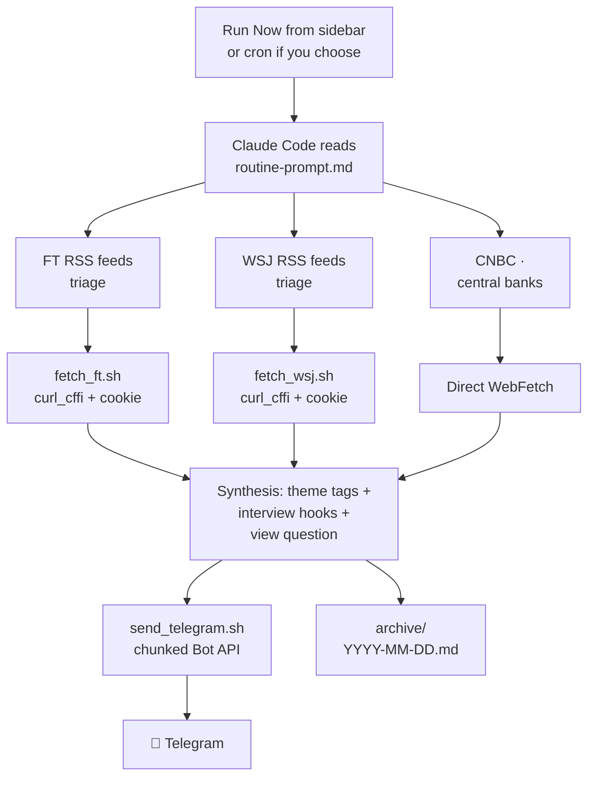

# news-fetch

[](LICENSE)
[](https://claude.com/claude-code)
[](https://agentskills.io)

> **A curated FT + WSJ markets brief delivered to Telegram on demand.** Subscriber-grade primary sources via paywall-bypass fetchers, theme-tagged stories with one-sentence interview hooks, and a view-forming question that forces you to take a position. Trigger it from the Claude Code sidebar whenever you want a brief — typically once a day in the morning.

<p align="center">
  
</p>

## Why this exists

Most "AI news digest" tools either (a) regurgitate Reddit/Twitter, or (b) summarise headlines you've already seen, badly. This routine flips it:

- **Subscriber-grade primary sources** — full FT + WSJ article bodies via [`curl_cffi`](https://github.com/lexiforest/curl_cffi) Chrome-131 TLS impersonation. Not headline scraping.
- **Explicit editorial rules** — sourcing priority FT > WSJ; no claim without a primary source; cite-what-you-fetched, never invented links.
- **Theme tagging for cross-day continuity** — every story gets a `[⏣ Theme]` tag (e.g. `⏣ AI capex`, `⏣ Term premium`, `⏣ UK fiscal`). Same theme = same tag, every day. After a month you absorb the dominant narratives reflexively.
- **A view-forming question every day** — one controversial question forced by today's stories, designed to make you actually take a position.

It's designed for someone who reads the news for a *reason* — research, trading, monitoring a beat — not just ambient awareness. The opinionated bits are the value. Fork it, tune it for your beat.

## What lands in your Telegram when you run it

The screenshot above is from a real morning brief. Full text of [a real archived brief is in `examples/sample-brief.md`](examples/sample-brief.md). Quick excerpt:

<details>
<summary>📱 Click to expand brief excerpt</summary>

```
*📈 Markets Briefing — Tuesday, 05 May 2026*

*🌍 Market in 60 seconds*
S&P 500 closed at a fresh record of 7,259 (+0.81%) and Nasdaq hit
25,326 (+1.03%) as AMD's blowout Q1 results and chip-sector optimism
drove tech higher; Brent crude pulled back 4% from Monday's $114 high...

*📊 Earnings today*
BMO: HSBC (miss — $9.4B vs $9.59B est), Lloyds (beat), StanChart (beat)
AMC: AMD (beat — rev $10.25B vs $9.85B est, +4.4% AH)

*💱 Macro & rates*

*1. [⏣ Energy security] Global oil reserves approaching 8-year low*
Global crude stockpiles fell nearly 200mn barrels (6.6mn b/d) in April...
_Why it matters:_ Jim Burkhard of S&P Global put it plainly — "the
tipping point" where stocks hit critical levels is weeks away. At 45
days of cover, the next supply disruption reprices energy violently.
🔗 https://www.ft.com/content/3beeb26f-6c35-46a9-b116-42edbe6552fd

[... continues for ~12 stories across Macro / Equities / M&A / a
deep-read pick / a view-forming question ...]

*🎯 Today's view-forming question*
If 30Y gilts hold above 5.75% through Thursday's local elections,
which UK bank's loan book is most exposed to MFS-style credit events?
Defend either side.
```

</details>

## How it works



**Sources are tiered**: FT (primary, full-body) · WSJ (peer, full-body) · CNBC + central banks (aggregator/event-only). Reuters and Bloomberg are intentionally excluded — both use aggressive anti-bot protection (DataDome / PerimeterX) that defeats `curl_cffi` even with valid cookies; only a real-browser approach (Playwright) would work. See [SETUP.md](SETUP.md) for source-specific notes.

## Install

**Time required**: 30–45 minutes (mostly waiting on BotFather and browser tabs — the actual scripted part is ~10 min).
**Difficulty**: comfortable with Terminal, a Cookie-Editor browser extension, and editing JSON.
**Prerequisites**: macOS · [Claude Code](https://claude.com/claude-code) 2.x · Python 3.9+ · a Telegram account · *(optional but encouraged)* an FT and/or WSJ subscription.

```bash
# Clone
git clone https://github.com/GeniusTrader-Harry/news-fetch.git ~/news-fetch
cd ~/news-fetch

# Install Python deps (curl_cffi is the paywall-bypass library)
python3 -m venv venv
source venv/bin/activate
pip install curl_cffi
```

Then in Claude Code, with the folder open, **invoke the bundled setup skill**:

```
/news-fetch-setup
```

It walks you through every remaining step interactively — Telegram bot creation, cookie export, Claude Code permission allowlist, folder trust dialog, scheduled task registration (set up as manual-trigger by default; cron is optional), end-to-end test. **For a non-interactive walkthrough see [SETUP.md](SETUP.md).**

## Customisation

The published prompt ships with an opinionated example: a markets brief with US-anchored geography, themes like *AI capex* / *Term premium* / *UK fiscal*, and a finance-flavoured view-forming question. **All of this is meant to be tuned for your beat.** See **[CUSTOMISATION.md](CUSTOMISATION.md)** for how to swap:

| What | Where |
|---|---|
| Audience framing | line 1 of [routine-prompt.md](routine-prompt.md) |
| Geography weighting (current default: US/UK/EU/Asia 50/25/15/10) | Quality bar block |
| Theme dictionary | Step 2 → Theme tags |
| Section sizes (Macro / Equities / M&A counts) | Output format |
| Sources (add/remove outlets) | Step 1 + Quality bar |
| View-forming question style | Output format |

## What's in this repo

| File | Role |
|---|---|
| [routine-prompt.md](routine-prompt.md) | The prompt the scheduled task runs each time you trigger it. Templated — replace `<USER_NAME>` and `<PROJECT_DIR>` during setup. |
| [send_telegram.sh](send_telegram.sh) | Reads `.env`, chunks brief into ≤3800-char messages, POSTs to Telegram Bot API. Falls back to plain-text if Markdown parsing fails. |
| [fetch_ft.py](fetch_ft.py) / [fetch_ft.sh](fetch_ft.sh) | FT article fetcher: `curl_cffi` Chrome-131 TLS impersonation + your session cookie → JSON-LD body extraction → clean markdown. |
| [fetch_wsj.py](fetch_wsj.py) / [fetch_wsj.sh](fetch_wsj.sh) | WSJ fetcher: same TLS approach + hybrid extraction (JSON-LD metadata + `<p data-type="paragraph">` regex with style-block stripping). |
| [discover_wsj.py](discover_wsj.py) / [discover_wsj.sh](discover_wsj.sh) | WSJ URL discovery: scrapes wsj.com section pages (Markets / Finance / Business / Economy) via curl_cffi+cookie and outputs fresh article URLs. Used instead of WSJ's RSS feeds, which periodically go stale for days. |
| [skills/news-fetch-setup/SKILL.md](skills/news-fetch-setup/SKILL.md) | Interactive Claude Code skill that walks you through full setup. |
| [examples/sample-brief.md](examples/sample-brief.md) | A real morning brief — full text. |
| [SETUP.md](SETUP.md) | Non-interactive 14-step manual walkthrough. |
| [CUSTOMISATION.md](CUSTOMISATION.md) | How to tune the prompt for your beat. |

## Limitations and honest caveats

- **Default mode is manual-trigger.** You click Run Now in the Claude Code Scheduled sidebar when you want a brief — typically once each morning. This is the most reliable mode because it doesn't depend on your laptop being awake at a specific time.
- **Autonomous-cron mode is optional but unreliable on laptops.** If you set a cron schedule, the run fires only if Claude Code is open AND the Mac is awake AND not in Low Power Mode at fire time. macOS Low Power Mode in particular throttles or defers scheduled tasks silently. For true daily autonomy, run on an always-on machine (a $4/month VPS works fine).
- **Cookie maintenance**: FT and WSJ session cookies expire every 2–4 weeks. The brief detects expiry (`⚠️ cookie may need refresh`) — re-export from Chrome takes ~30 seconds.
- **Quality varies with model effort**: targeted at Claude Code's high-effort mode. Lower-effort runs produce blander hooks.
- **Brand-new repo**: no community usage yet, no proven robustness across edge cases. Issues + PRs welcome.

## Contributing

Fork it, tune it, share it back. Areas where contributions land especially well:

- Linux / Windows / VPS deployment recipes for fully autonomous mode
- Other paywalled outlets people have working fetchers for (Economist, Barron's, etc.)
- Theme dictionaries for non-finance beats (climate, biotech, geopolitics, etc.)

See [.github/ISSUE_TEMPLATE/](.github/ISSUE_TEMPLATE/) for the issue templates if you hit a bug or have a suggestion.

## License

MIT — see [LICENSE](LICENSE).

---

Built with [Claude Code](https://claude.com/claude-code).
